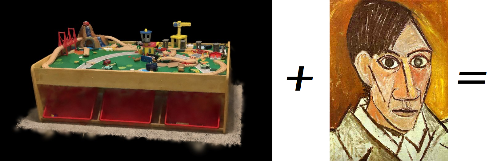
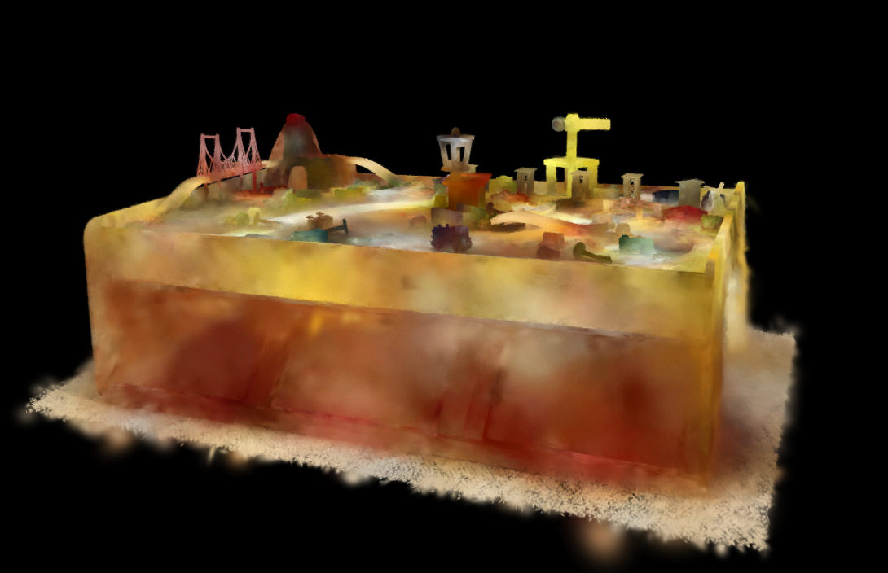

# Interpolation-Methods-for-Applying-2D-Neural-Networks-to-3D-Gaussian-Splats

Gaussian splatting, a volume rendering method that enables real time displays of radiance fields and even dynamic 4D scenes, represent the cutting-edge of current 3D rendering techniques. This method has proven highly effective for higher dimensional media. A perennial challenge of performing machine learning on 3D and higher dimensional media is the difficulty of training models, both due to the inherent difficulty of finding optimal solutions in higher dimensions and due to the paucity of good datasets for anything other than 2D digital photos.

The sheer volume of excellent 2D datasets, and already-trained models that perform an absolute plethora of ML tasks, is an incredibly rich resource. That resource is the result of decades of research and enormous quantities of compute. As higher-dimensional rendering techniques proliferate, tapping such a resource for performing ML tasks on higher dimensional volumes could shave years off of research and developmental timelines, and hopefully reduce the amount of compute required for ML on volumes to reach the level of sophistication of current day ML on 2D images. Methods that allow for 2D image models to be directly used for ML on volumes are an important part of this, and deserve investigation.

This project aims to do just that.

Extending the interpolation method for interpolated convolution by [Hart, Whitney, and Morse 2023](https://openaccess.thecvf.com/content/WACV2023/papers/Hart_Interpolated_SelectionConv_for_Spherical_Images_and_Surfaces_WACV_2023_paper.pdf), this project will adapt that method to Gaussian splats and will investigate an effective pipeline for doing so. The anticipated result is a method of applying 2D ML models directly to Gaussian splats.

Preliminary results so far are encouraging. Here, a 3D Gaussian of a kid's play table was styled transfered using a 2D style transfer model and Picasso's "Self Portrait" is shown:

Sample code is available [here](https://github.com/Raphael-ECU/SelecConv_splats)
